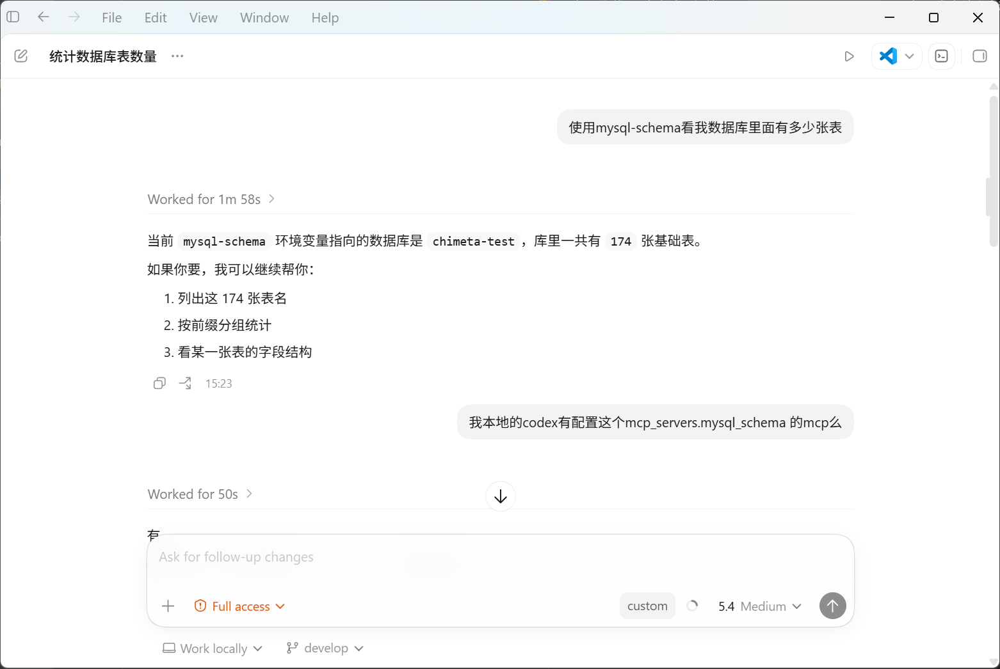

# MySQL Schema MCP 使用说明



## 1. 这是什么

这是一个只读的 MySQL Schema MCP 服务，用来给支持 MCP 的 AI 客户端提供通用的 MySQL 表结构访问能力。

当前提供 3 个工具：

- `list_tables`：列出当前数据库中的表
- `describe_table`：查看指定表的字段、主键、默认值、注释、索引
- `get_entity_context`：生成面向 Java Entity/DO 的字段上下文

## 2. 配置方式

当前版本不再使用环境变量。

MySQL 连接信息改为保存在本地 YAML 文件中：

- `src/main/resources/application-dev.yml`
- `src/main/resources/application-test.yml`
- `src/main/resources/application-prod.yml`

配置格式如下：

```yml
mysql:
  host: 127.0.0.1
  port: 3306
  database: your_database
  username: your_username
  password: your_password
```

你只需要按环境修改这些文件中的值即可。

## 3. 前置条件

- 已安装 Java 17 或以上版本
- 已安装 Maven 3.6 或以上版本
- 有可连接的 MySQL 只读账号

## 4. 构建

```powershell
cd 你的本地项目路径\mysql-schema-mcp
mvn clean package
```

构建成功后会同时生成 3 个 Jar：

- `target\mysql-schema-mcp-dev-0.1.0.jar`
- `target\mysql-schema-mcp-test-0.1.0.jar`
- `target\mysql-schema-mcp-prod-0.1.0.jar`

## 5. 启动方式

### 5.1 使用 PowerShell 启动脚本

默认使用 `dev` 环境：

```powershell
.\start-mysql-schema-mcp.ps1
```

指定 `test` 环境：

```powershell
.\start-mysql-schema-mcp.ps1 -Profile test
```

指定 `prod` 环境：

```powershell
.\start-mysql-schema-mcp.ps1 -Profile prod
```

### 5.2 直接运行 Jar

直接运行不同名字的 Jar，就会自动匹配对应环境：

```powershell
java -jar target\mysql-schema-mcp-dev-0.1.0.jar
java -jar target\mysql-schema-mcp-test-0.1.0.jar
java -jar target\mysql-schema-mcp-prod-0.1.0.jar
```

如果你想手工覆盖，也仍然可以显式指定：

```powershell
java -jar target\mysql-schema-mcp-dev-0.1.0.jar --profile test
java -jar target\mysql-schema-mcp-dev-0.1.0.jar --profile prod
```

程序会按以下顺序查找配置文件：

1. Jar 同目录下的 `application-{profile}.yml`
2. 当前工作目录下的 `application-{profile}.yml`
3. `src/main/resources/application-{profile}.yml`

## 6. MCP 客户端配置示例

```toml
[mcp_servers.mysql_schema]
command = "java"
args = ["-jar", "你的本地项目路径\\mysql-schema-mcp\\target\\mysql-schema-mcp-dev-0.1.0.jar"]
```

如果你想连测试库或生产库，把 Jar 名称改成 `test` 或 `prod` 对应版本即可。

## 7. 验证是否接入成功

在 AI 对话中尝试调用：

- `list_tables`
- `describe_table`
- `get_entity_context`

如果能返回表结构信息，说明接入成功。

## 8. `start-mysql-schema-mcp.ps1` 做了什么

这个脚本会：

- 检查 Jar 是否存在
- 检查对应环境的 YAML 配置文件是否存在
- 按指定 profile 启动 MCP

## 9. 常见问题

### 9.1 看不到 `mysql_schema`

检查顺序：

1. MCP 配置是否已保存
2. Jar 路径是否正确
3. 客户端是否已重启

### 9.2 连接数据库失败

检查顺序：

1. 当前环境对应的 `application-*.yml` 是否填写正确
2. 数据库是否允许当前机器访问
3. 账号是否至少具备读取 `information_schema` 的权限

### 9.3 `java` 命令找不到

说明 Java 未正确安装，或未加入 `PATH`。
